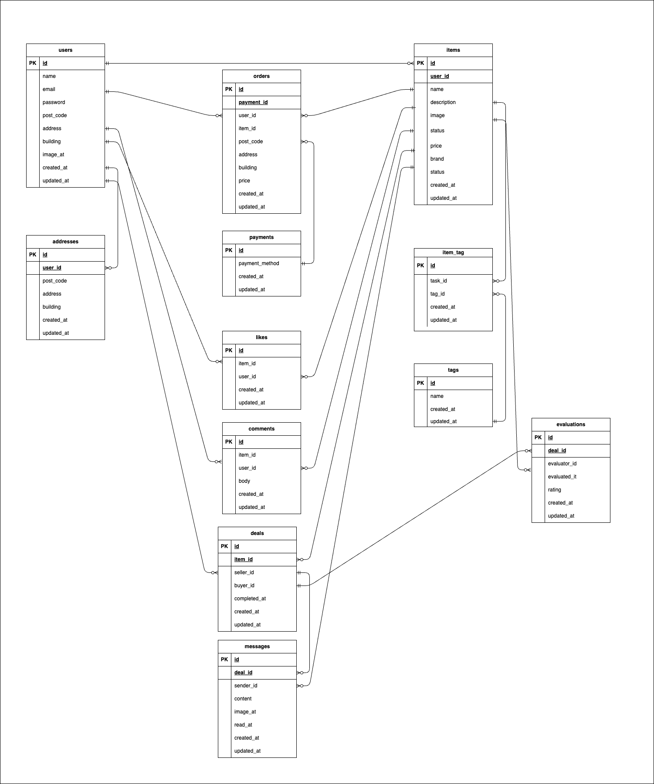

# 模擬案件_フリマアプリ

## 環境構築

## Dockerビルド

```
git clone https://github.com/sekirubeg/keita-free.git
docker-compose up -d --build
```

※MySQL は OS によって起動しない場合があります。必要に応じて docker-compose.yml を各自の環境に合わせて編集してください。

## Laravel 環境構築

```
docker-compose exec php bash
composer install
cp .env.example .env
php artisan key:generate
php artisan migrate
php artisan db:seed
php artisan storage:link
```
※"Failed to open stream: Permission denied"エラーが発生した場合
「storage」ディレクトリ以下の権限を変更してください
```
chmod -R 777 storage
```
## stripeによる決済
Stripeテストモードでの決済が可能です。必要に応じて .env に以下のように設定してください

```
STRIPE_PUBLIC_KEY=your_test_key
STRIPE_SECRET_KEY=your_test_secret
```
## main認証のためのmailtrapの設定

### Mailtrap のアカウント作成

https://mailtrap.io/ にアクセスし、無料アカウントを作成してください。
その後ダッシュボードにログインし、Inbox を作成してください
そしてInbox の「SMTP Settings」を開き、Laravel 用の接続情報を確認してください。

### .env にSMTP情報を設定
Mailtrapの設定にある「Laravel 9+」用の情報を、.env に貼り付けます。
```
MAIL_MAILER=smtp
MAIL_HOST=sandbox.smtp.mailtrap.io
MAIL_PORT=2525
MAIL_USERNAME=
MAIL_PASSWORD=
```
### PHP.Unitによるテスト
ログアウトのテストをするときはweb.phpにある”テスト時のlogoutルートをコメントアウトして行ってください。
いいね機能のテストおよび、支払い方法選択のテストは、javaScriptの変化を捉えなければならず、<br>
php.unitだけではテストすることが不可能だったため、テストから除外しています。

## test 環境構築
```
docker-compose exec mysql bash
mysql -u root -p
> CREATE DATABASE demo_test;
> SHOW DATABASES;
```
## configファイルの変更　
configディレクトリの中のdatabase.phpを開き、mysqlの配列部分をコピーして以下に新たにmysql_testを作成します。<br>
下記のようにしてください。
```
'mysql' => [
// 中略
],

+ 'mysql_test' => [
+             'driver' => 'mysql',
+             'url' => env('DATABASE_URL'),
+             'host' => env('DB_HOST', '127.0.0.1'),
+             'port' => env('DB_PORT', '3306'),
+             'database' => 'demo_test',
+             'username' => 'root',
+             'password' => 'root',
+             'unix_socket' => env('DB_SOCKET', ''),
+             'charset' => 'utf8mb4',
+             'collation' => 'utf8mb4_unicode_ci',
+             'prefix' => '',
+             'prefix_indexes' => true,
+             'strict' => true,
+             'engine' => null,
+             'options' => extension_loaded('pdo_mysql') ? array_filter([
+                 PDO::MYSQL_ATTR_SSL_CA => env('MYSQL_ATTR_SSL_CA'),
+             ]) : [],
+ ],
```
## テスト用の.envファイル作成
```
cp .env .env.testing
```
## ファイルの作成ができたたら、.env.testingファイルの文頭部分にあるAPP_ENVとAPP_KEYを編集します。
```
APP_NAME=Laravel
- APP_ENV=local
- APP_KEY=base64:vPtYQu63T1fmcyeBgEPd0fJ+jvmnzjYMaUf7d5iuB+c=
+ APP_ENV=test
+ APP_KEY=
APP_DEBUG=true
APP_URL=http://localhost
```
## 次に、.env.testingにデータベースの接続情報を加えてください
```
  DB_CONNECTION=mysql
  DB_HOST=mysql
  DB_PORT=3306
- DB_DATABASE=laravel_db
- DB_USERNAME=laravel_user
- DB_PASSWORD=laravel_pass
+ DB_DATABASE=demo_test
+ DB_USERNAME=root
+ DB_PASSWORD=root
```
## 最後に以下のコマンドを実行してください

```
php artisan key:generate --env=testing
php artisan config:clear
php artisan migrate --env=testing
php artisan test
```

## 使用技術
```
PHP 8.2.28
Laravel 11.44.2
MySQL 8.0.40
```
## URL
```
開発環境: http://localhost/
phpMyAdmin: http://localhost:8080/
```
## ER図

